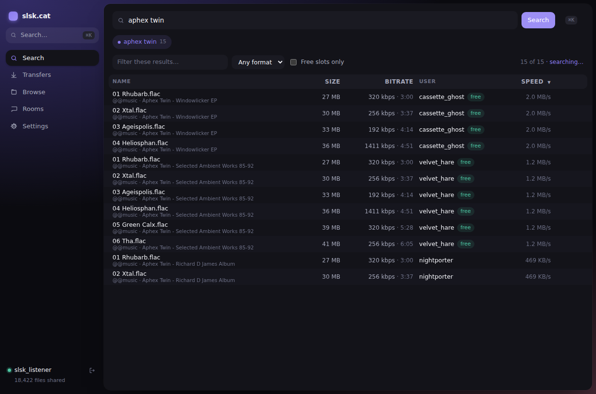
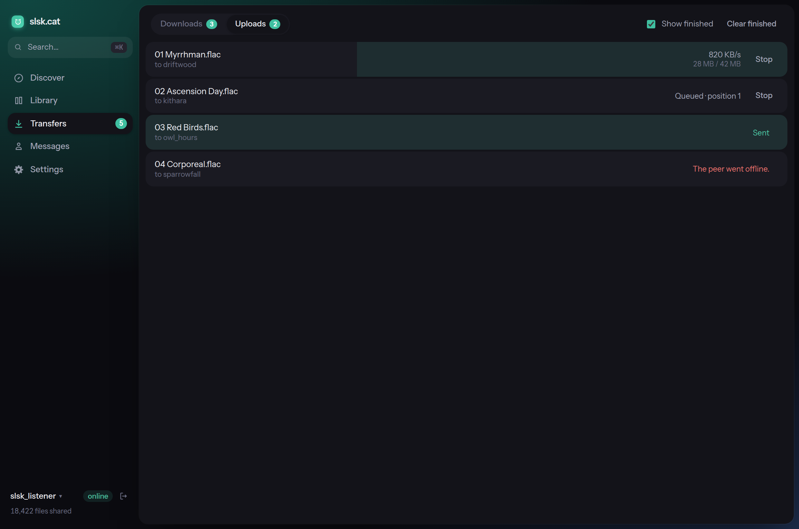
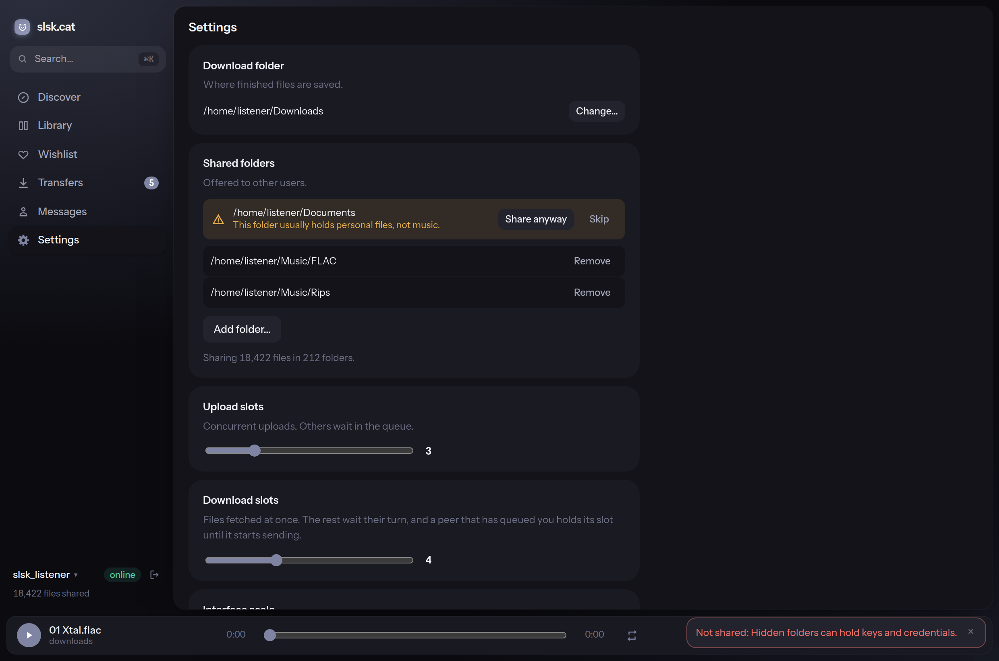
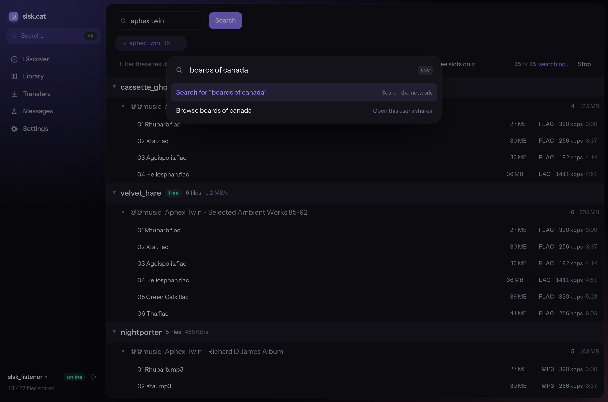
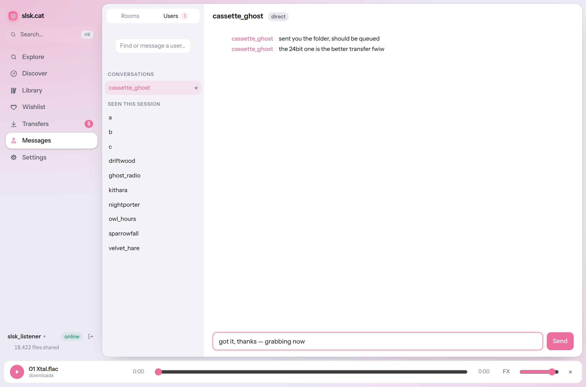

# slsk.cat

A Soulseek client for the desktop. Native installed software — no browser, no
server, no localhost URL. The protocol core and the app backend are both Rust
in one process; the interface is rendered by the OS WebView.

5.5 MB binary, ~110 KB of interface assets.



<p align="center">
  
  
</p>
<p align="center">
  
  
</p>

> Early. Nothing has been run against the live Soulseek network yet —
> [VERIFY.md](VERIFY.md) is the checklist for doing that and then publishing.
> [RESEARCH.md](RESEARCH.md) records how the stack was chosen.

## Layout

```
crates/
  slskcat-core/    protocol core — Commands in, Events out
  slskcat-app/     Tauri backend — routes between the core and the WebView
ui/                Svelte 5 interface
```

### `slskcat-core`

- `model` — domain types (`SearchHit`, `Transfer`, `Room`, …). Names no
  protocol library.
- `command` / `event` — the two currencies the interface deals in.
- `backend` — the `Backend` trait, the seam the protocol library sits behind.
- `live` — the real backend, over [`soulseek-rs-lib`]. The only module that
  names that library.
- `engine` — owns the worker thread and the command/event channels.

The interface never blocks on the network. It sends a command and reacts to
events:

```rust
use slskcat_core::{Command, Engine, LiveBackend, model::Config};

let engine = Engine::spawn(LiveBackend::new());
engine.send(Command::Connect(Box::new(Config::default())));

for event in engine.drain() {
    println!("{event:?}");
}
```

Commands are fire-and-forget — failures come back as `Event::Warning` or a
specific failure event, never as a return value. The protocol library is
synchronous, so searches and transfers run on their own threads and report
progress through `Backend::poll` on a fixed tick.

`soulseek-rs-lib` is pinned to an exact version and confined to one module, so
replacing it — with a fork, or an out-of-process daemon — stays contained. The
same seam is why swapping the UI toolkit (Tauri, previously Iced) cost nothing.

### `slskcat-app`

Thin. Each user action is a `#[tauri::command]` forwarding a `Command`; one
thread owns the `Engine` and republishes every `Event` to the WebView on a
single channel. No protocol knowledge of its own.

`settings.rs` is the exception, since persistence is an application concern.

### `ui`

Svelte 5 with runes. `lib/core.ts` is the only file that imports Tauri;
`lib/state.svelte.ts` is the only place events are applied. Search results are
windowed, so a query returning tens of thousands of files renders a few dozen
rows.

## Privacy and security

- **Shared folders are classified before they go on the network.** The
  defining failure of consumer P2P was people sharing a folder they did not
  mean to — whole home directories, keys and tax returns included. So
  `guard.rs` refuses the filesystem root, `$HOME` itself, system directories,
  and **any path with a hidden component** (`~/.ssh`, `~/.gnupg`, `~/.config`);
  it flags conventionally personal folders (`~/Documents`, `~/Desktop`) for
  explicit confirmation. This is enforced in the core, not the interface, so a
  hand-edited settings file or a UI bug still cannot expose a credential
  directory. Share roots are resolved before judging, so a symlink dressed up
  as a music folder (`~/Music/keys -> ~/.ssh`) is refused by its target;
  symlinks *inside* a shared tree need no handling because the indexer skips
  them outright.
- **The password goes to the OS credential store** — Keychain, Credential
  Manager, or the D-Bus Secret Service — never to disk in the clear.
  Remembering it is opt-in. A store that cannot be reached degrades to
  "password not remembered" and says so.
- **`settings.json` is owner-only** (`0600`, in a `0700` directory). It names
  the account and every shared path, which is enough to profile a library.
- **Strict CSP**: `default-src 'self'`. No web fonts, no CDN, no external
  requests of any kind from the interface.
- **Minimal capabilities**: the WebView is granted `core:default` and
  `dialog:allow-open`, nothing more.
- **No telemetry, no analytics, no update pings.** The only network traffic is
  Soulseek itself.
- **The credential-store round trip is tested**, not just claimed: store,
  read, forget, and read-again-empty, against a real `gnome-keyring`. Those
  tests are `#[ignore]`d because CI has no session keyring — the doc comment on
  them gives the `dbus-run-session` command to run them.
- **The password is never logged.** Verified across every logging macro in the
  protocol library, which defaults to `WARN` and is raised only by setting
  `LOG_LEVEL`/`RUST_LOG` yourself.
- **Dependencies are audited in CI.** `cargo audit` and `pnpm audit` both run
  on every push and fail the build. Currently zero vulnerabilities.
  `.cargo/audit.toml` ignores seventeen `unmaintained`/`unsound` advisories,
  each listed individually with a reason — all of them Tauri's GTK3 Linux
  bindings or build-time codegen crates, none of them ours to update. Anything
  new breaks the build.

Soulseek is a public P2P network: peers see your username, your shared file
list, and your address when transferring. Nothing here changes that.

## Interface

The layout follows Arc: the window is a coloured field, the content floats on
it as one rounded canvas, and navigation lives entirely in the sidebar. No top
chrome.

- Each section owns an accent — indigo for search, blue for wishlist, teal for
  transfers, amber for browse, rose for rooms — and the field tints to match.
- ⌘K opens the command bar. It is search-first: type anything and the top
  action runs it against the network.
- Wishlist is its own section: standing searches the server re-runs on the
  interval it dictates, so hits accumulate while you are elsewhere.
- Transfers are two tabs, downloads and uploads, given equal weight — uploads
  are what other people see of you. Upload rows fill from the right, so
  direction reads before the text does.
- Separation comes from elevation and colour, not borders.
- `prefers-reduced-motion` is honoured.

Both colour schemes are designed rather than inverted, and follow the system
setting.

## Building

Needs a stable Rust toolchain, Node 20+, and pnpm. On Linux also the Tauri
system dependencies (`libwebkit2gtk-4.1-dev`, `libxdo-dev`, `libssl-dev`,
`libayatana-appindicator3-dev`, `librsvg2-dev`).

```bash
pnpm --dir ui install
cargo install tauri-cli --version "^2" --locked

cargo test                        # 59 tests + 2 keyring-gated
cargo clippy --all-targets        # clean under pedantic lints
pnpm --dir ui build               # typecheck + bundle
```

Running and packaging go through the Tauri CLI. It is `cargo tauri`, a cargo
subcommand — there is no `tauri` on your `PATH` — and it finds
`crates/slskcat-app/tauri.conf.json` itself, so any directory in the repo
works:

```bash
cargo tauri dev                   # run it; starts Vite itself
cargo tauri build                 # package it
```

The CLI is also on npm as `@tauri-apps/cli`, which ships prebuilt binaries
instead of compiling one. Either is the same program; `pnpm dlx
@tauri-apps/cli@2 build` works without installing anything. (The bare `tauri`
package on npm is the abandoned pre-1.0 one, last published at 0.15.0. It does
not understand this project.)

**Use the CLI, not `cargo run`.** The CLI enables the `custom-protocol`
feature, and that is what compiles `ui/dist` into the binary. Without it the
window is pointed at `devUrl` instead, in every profile — `cargo run
-p slskcat-app`, release included, needs a dev server running or it opens
blank.

`cargo tauri build --bundles deb` produces a ~2 MB `.deb` carrying the binary,
icons and a desktop entry, depending only on `libwebkit2gtk-4.1-0` and
`libgtk-3-0`. That was measured before `custom-protocol` was declared, so the
size will have grown by the frontend and the bundle has not been re-verified
since. The Windows and macOS bundles are configured (`.ico` and `.icns` are
generated and wired up) but cannot be built or verified from Linux.

`.github/workflows/ci.yml` runs the same checks on every push, in three jobs:
Rust (fmt, clippy with warnings denied, tests), frontend (typecheck and
bundle), and a dependency audit.

### Checking it against the live network

Nothing in the test suite touches the network, so this is the only thing that
can tell you whether the protocol integration actually works. It drives the
same `Engine` the application does, so a pass means the core works, not merely
that the library does. Credentials are read from the environment and never
printed or stored:

```bash
SLSKCAT_USER=yourname SLSKCAT_PASS=yourpassword   cargo run -p slskcat-core --example smoke
```

It checks sign-in, the room list, streaming search hits, browsing a peer and
fetching their details, then exits non-zero if any step failed.
`SLSKCAT_DOWNLOAD=1` also queues the smallest hit and waits for real bytes;
`SLSKCAT_QUERY` and `SLSKCAT_TIMEOUT` tune the rest.

### Reviewing the interface without a desktop

`ui/tools/screenshots.mjs` renders the built interface in headless Chromium
against a mocked Tauri bridge, driving it through sign-in, search, the command
bar, transfers, rooms and settings in both colour schemes. Playwright is not a
dependency; install it on demand:

```bash
pnpm build
python3 -m http.server 8899 -d dist &
pnpm dlx playwright@latest
node tools/screenshots.mjs ../docs
```

## Not done yet

- **Never run against the live network.** Every test here is offline, and this
  environment cannot reach the Soulseek ports at all. `examples/smoke.rs`
  exists to close this, but somebody has to run it.
- Only the Linux `.deb` bundle has been built here. `.github/workflows/release.yml`
  builds `rpm`, `AppImage`, `msi`, NSIS and `dmg` on their native runners, but
  it has not run yet — pushing a `v*` tag is what verifies it.

## Known limitations

- **Linux rendering.** Tauri uses WebKitGTK there, the weakest of the three
  platform WebViews; occasional visual artefacts are possible. Windows and
  macOS use Chromium-based and WebKit engines respectively.

## Licence

MIT.

[`soulseek-rs-lib`]: https://github.com/michel/soulseek-rs
