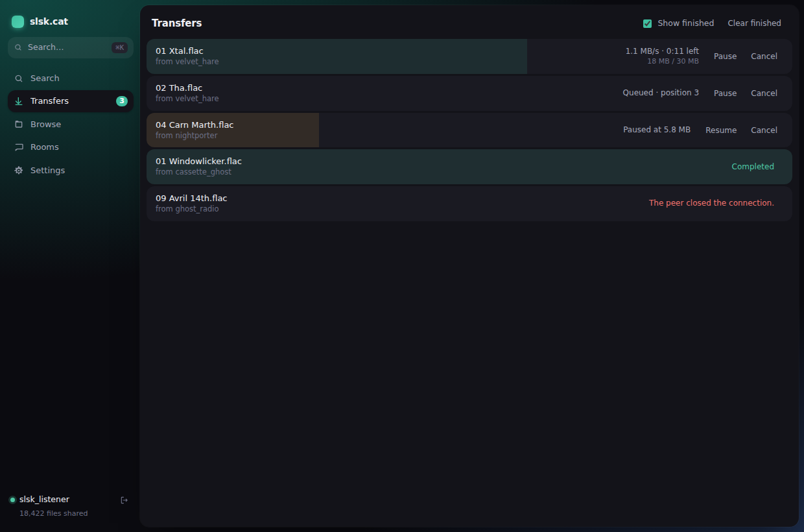
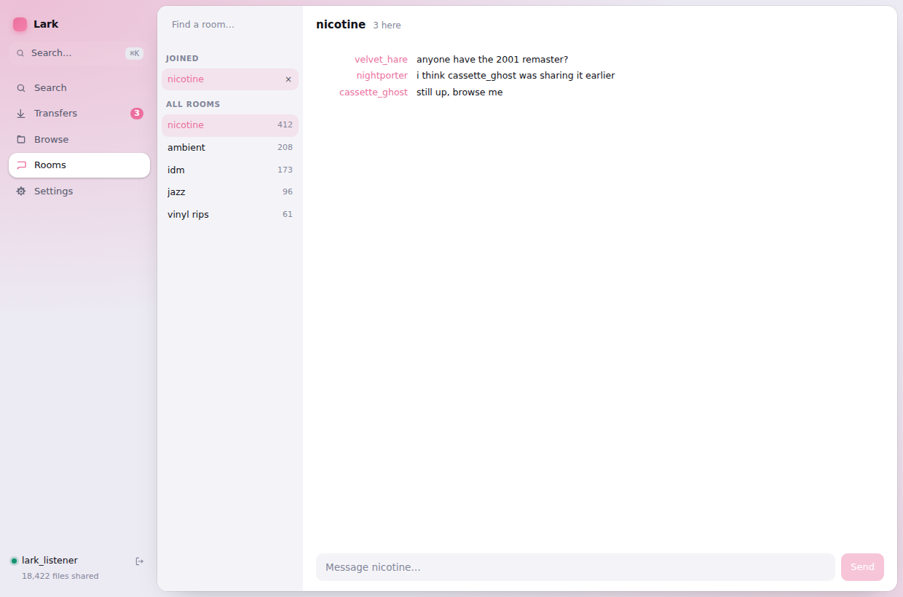

# Lark

A lightweight Soulseek client for the desktop.

Native installed software — no browser, no server, no localhost URL. The
protocol core and the app backend are both Rust in a single process, with the
interface rendered by the OS WebView.

**4.5 MB binary, ~110 KB of interface assets.**


<p align="center">
  
  
</p>
<p align="center"></p>

> **Status:** early. The core and the app shell are built and compile clean;
> nothing has yet been tested against the live Soulseek network.
> See [RESEARCH.md](RESEARCH.md) for how the stack was chosen — including the
> reasoning that was revised along the way.

## Layout

```
crates/
  lark-core/     protocol core — Commands in, Events out
  lark-app/      Tauri backend — routes between the core and the WebView
ui/              Svelte 5 interface
```

### `lark-core`

- `model` — domain types (`SearchHit`, `Transfer`, `Room`, …). Mentions no
  protocol library.
- `command` / `event` — the two currencies the interface deals in.
- `backend` — the `Backend` trait, the seam the protocol library sits behind.
- `live` — the real backend, over [`soulseek-rs-lib`]. The only module that
  names that library.
- `engine` — owns the worker thread and the command/event channels.

### `lark-app`

Deliberately thin. Each user action is a `#[tauri::command]` forwarding a
`Command`; one thread owns the `Engine` and republishes every `Event` to the
WebView on a single channel. It holds no protocol knowledge of its own.

`settings.rs` is the exception, because persistence is an application concern
rather than a protocol one. Preferences go to `settings.json` in the platform
config directory; the **password goes to the OS credential store** — Keychain,
Credential Manager, or the D-Bus Secret Service — and never to disk in the
clear. A credential store that cannot be reached (a headless Linux box with no
session keyring) degrades to "password not remembered" and says so, rather
than failing to start.

### `ui`

Svelte 5 with runes. `lib/core.ts` is the only file that imports Tauri;
`lib/state.svelte.ts` is the only place events are applied. Search results are
windowed, so a query returning tens of thousands of files renders a few dozen
rows.

## Interface

The design borrows its organising idea from Arc: the window is a coloured
field, and the content floats on it as a single rounded canvas. Navigation
lives entirely in the sidebar, so there is no top chrome at all.

- **Sections are places.** Each one owns an accent — indigo for search, teal
  for transfers, amber for browse, rose for rooms — and the field behind the
  canvas tints to match, so moving between them reads as moving somewhere.
- **⌘K opens the command bar.** It is search-first: type anything and the top
  action runs it against the network, with browse and navigation underneath.
- **Separation by elevation and colour, not borders.** Almost no rules or
  dividers; surfaces sit at different depths instead.
- **Springy, restrained motion**, and `prefers-reduced-motion` is honoured.

Both colour schemes are designed rather than inverted, and the interface
follows the system setting.

## Design

The interface never blocks on the network. It sends a command and reacts to
events:

```rust
use lark_core::{Command, Engine, LiveBackend, model::Config};

let engine = Engine::spawn(LiveBackend::new());
engine.send(Command::Connect(Box::new(Config::default())));

for event in engine.drain() {
    println!("{event:?}");
}
```

Commands are fire-and-forget — failures come back as `Event::Warning` or a
specific failure event, never as a return value. The protocol library is
synchronous, so searches and transfers run on their own threads and report
progress through `Backend::poll` on a fixed tick.

### Why the `Backend` seam exists

`soulseek-rs-lib` is capable and actively developed, but it is a young
solo-maintained project that has broken its API often. It is pinned to an exact
version and confined to one module, so replacing it — with a fork, or with an
out-of-process daemon — stays a contained change.

The same seam is why the shell decision (Tauri, previously Iced) cost nothing
to reverse: the core has no idea what draws the window.

## Building

Requires a stable Rust toolchain, Node 20+, and pnpm. On Linux you also need
the Tauri system dependencies (`libwebkit2gtk-4.1-dev`, `libxdo-dev`,
`libssl-dev`, `libayatana-appindicator3-dev`, `librsvg2-dev`).

```bash
pnpm --dir ui install

cargo test                        # 34 unit tests, no network needed
cargo clippy --all-targets        # clean under pedantic lints
pnpm --dir ui build               # typecheck + bundle

cargo tauri dev                   # run the app
```

### Reviewing the interface without a desktop

`ui/tools/screenshots.mjs` renders the built interface in headless Chromium
against a mocked Tauri bridge, driving it through sign-in, search, the command
bar, transfers and rooms in both colour schemes. It is how the screenshots
above were produced, and how the UI is checked in environments with no display
server. Playwright is deliberately not a dependency — install it on demand:

```bash
pnpm build
python3 -m http.server 8899 -d dist &
pnpm dlx playwright@latest        # once
node tools/screenshots.mjs ../docs
```

## Not done yet

The architecture, the core and the interface are built and verified. These are
the known gaps:

- **Never tested against the live network.** Login, transfers and browsing are
  unproven end to end; every test here is offline.
- **Private messages** arrive and are stored, but nothing renders them and
  there is no way to send one.
- **Uploads have no screen.** You cannot see who is downloading from you, or
  your queue.
- **Wishlist** is supported by the protocol library and not wired up.
- `requestUserInfo` and `cancelSearch` are in the bridge and called by nothing.
- No CI, no packaging run (`tauri build`), no Windows `.ico`.

## Known limitations
- **Linux rendering.** Tauri uses WebKitGTK there, which is the weakest of the
  three platform WebViews; occasional visual artefacts are possible. Windows
  and macOS use Chromium-based and WebKit engines respectively and are solid.

## Licence

MIT.

[`soulseek-rs-lib`]: https://github.com/michel/soulseek-rs
